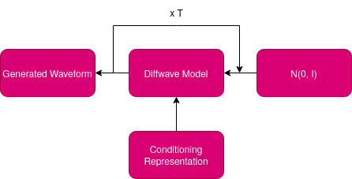
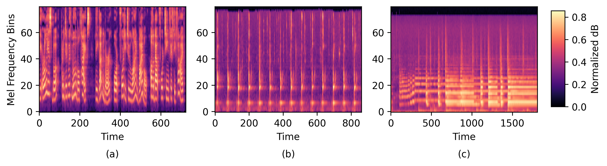
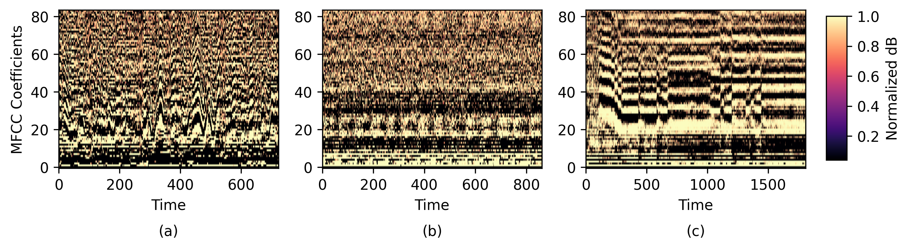
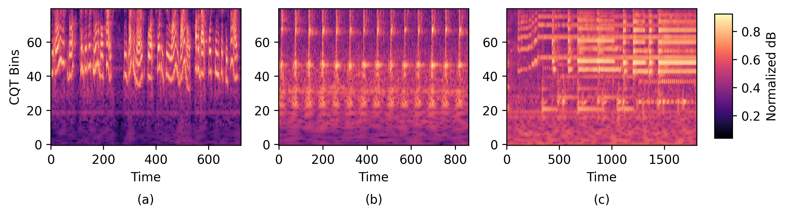
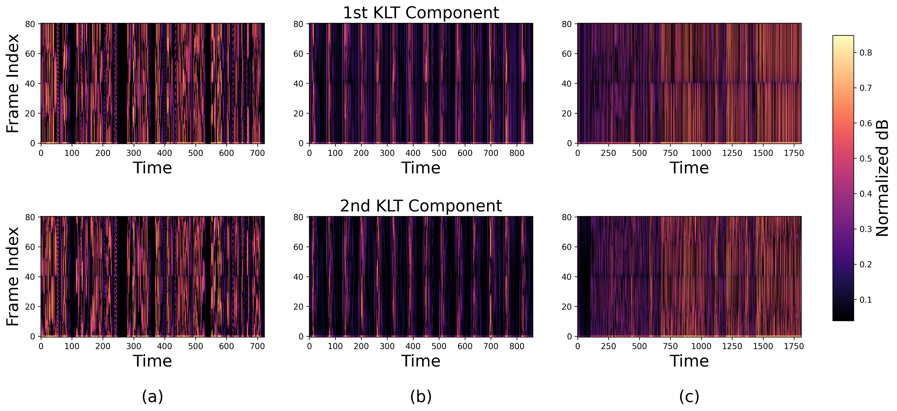
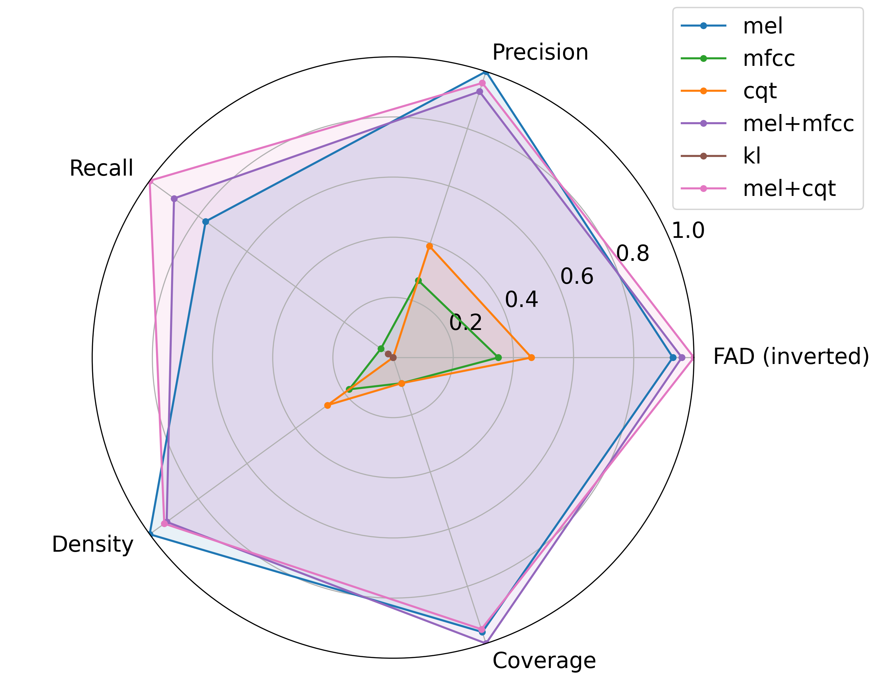
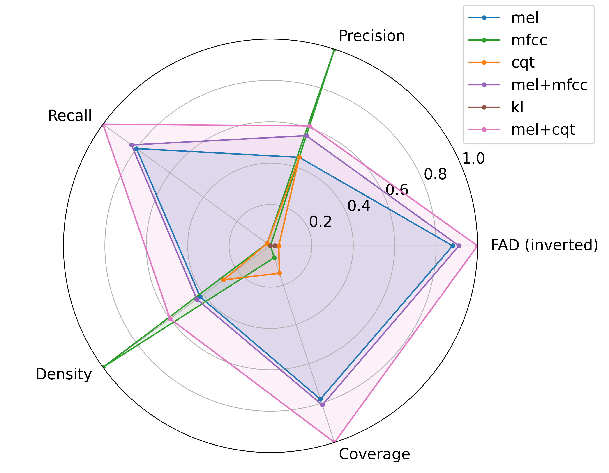
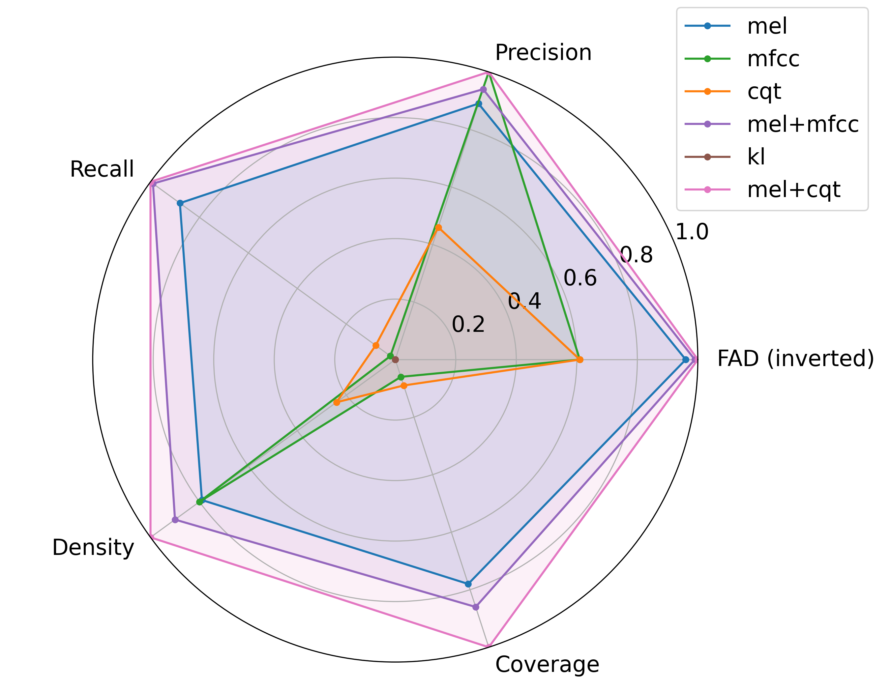

# Feature Conditioned Diffusion for Audio Generation

Official code for **Feature Conditioned Diffusion for Audio Generation**, presented at the **2025 IEEE 19th International Conference on Industrial and Information Systems (ICIIS)**.

**Shakthi Perera · Sandunika Ranasinghe · Senith Jayakody · Buwaneka Epakanda · Roshan Godaliyadda · Mervyn Parakrama Ekanayake**

University of Peradeniya, Sri Lanka

[Paper](https://ieeexplore.ieee.org/document/11450741) | [DOI](https://doi.org/10.1109/ICIIS69028.2026.11450741) | [Original DiffWave Code](https://github.com/lmnt-com/diffwave)

## Overview

We study how different audio features guide a diffusion model to generate waveforms. Starting from the original DiffWave implementation, we compare Mel spectrograms, Mel Frequency Cepstral Coefficients (MFCCs), Constant Q Transform (CQT), Karhunen–Loève Transform (KLT), and the combinations **Mel+MFCC** and **Mel+CQT**.

We evaluate these conditioning methods on **LJSpeech** for speech, **ESC-50** for environmental sounds, and **IRMAS** for music. Combining Mel and CQT gives the lowest Fréchet Audio Distance (FAD) across all three datasets in our experiments.

## Method

The model starts with Gaussian noise and gradually denoises it into an audio waveform, guided by the selected conditioning representation.

<p align="center">
  
</p>

*Figure 1. Audio generation from noise using feature conditioning.*

The paper uses 80 coefficients for Mel, MFCC, and CQT, with a hop size of 256 samples. Mel and MFCC use an FFT size and window size of 1024. CQT uses 12 bins per octave. KLT retains two components from an 80-dimensional basis. Hybrid features are supplied as two input channels.

## Conditioning Representations

The examples below show **(a) LJSpeech, (b) ESC-50, and (c) IRMAS** from left to right.

### Mel Spectrogram

Mel spectrograms describe how energy changes over time on a frequency scale aligned with human hearing.



### MFCC

MFCCs provide a compact description of the spectral envelope and timbral characteristics.



### CQT

CQT uses logarithmically spaced frequency bins to capture pitch and harmonic structure.



### KLT

KLT projects spectral features onto a decorrelated basis. We study conditioning with the first two components.



## Key Results

**Mel+CQT achieves the lowest FAD on every dataset.** Mel supplies perceptually useful spectral information, while CQT adds harmonic detail. Their combination improves audio fidelity and diversity compared with Mel conditioning alone. These values are reported in Table I of the [paper](https://ieeexplore.ieee.org/document/11450741).

| Dataset | Audio type | Mel FAD ↓ | Mel+CQT FAD ↓ |
| --- | --- | ---: | ---: |
| LJSpeech | Speech | 6.19 | **5.45** |
| ESC-50 | Environmental sounds | 8.38 | **6.71** |
| IRMAS | Music | 5.63 | **4.60** |

The radar plots compare FAD, precision, recall, density, and coverage. Values are normalized, and FAD is inverted so that larger values indicate better performance on every axis. Mel+CQT offers the strongest overall balance, although individual methods can score higher on particular metrics.

<table>
  <tr>
    <th>LJSpeech</th>
    <th>ESC-50</th>
    <th>IRMAS</th>
  </tr>
  <tr>
    <td></td>
    <td></td>
    <td></td>
  </tr>
</table>

## Folder Structure

```text
.
├── plots/                         # Feature examples, model diagram, and results
├── src/
│   └── diffwave/                  # Single-channel conditioning
│       ├── preprocess.py          # Mel
│       ├── preprocess_mfcc.py      # MFCC
│       ├── preprocess_cqt.py       # CQT
│       ├── params.py              # Feature and training settings
│       ├── model.py               # DiffWave model
│       ├── dataset.py             # Dataset loading
│       ├── learner.py             # Training
│       └── inference.py           # Waveform generation
├── src2/
│   └── diffwave/                  # Two-channel conditioning
│       ├── preprocess_mel+mfcc.py # Mel+MFCC
│       ├── preprocess_mel+cqt.py  # Mel+CQT
│       ├── preprocess_klt.py      # Two KLT component maps
│       └── ...                    # Model, data, training, and inference modules
├── setup.py                       # Package dependencies
├── LICENSE
└── README.md
```

Preprocessing saves features as `<audio filename>.spec.npy`. Use `src` for single-channel experiments and `src2` for two-channel experiments, with the matching parameters and model. Implementation choices for details not fully specified in the paper are documented in the CQT and KLT preprocessors.

## Acknowledgements

This codebase is built on the [original official DiffWave implementation by LMNT](https://github.com/lmnt-com/diffwave), accompanying [DiffWave: A Versatile Diffusion Model for Audio Synthesis](https://arxiv.org/abs/2009.09761). We thank the original authors and maintainers for making their code available. The original license and copyright notices are retained.

## Citation

If you use this work in your research, please cite our paper:

```bibtex
@inproceedings{perera2026feature,
  author    = {Shakthi Perera and Sandunika Ranasinghe and Senith Jayakody and
               Buwaneka Epakanda and Roshan Godaliyadda and Mervyn Parakrama Ekanayake},
  title     = {Feature Conditioned Diffusion for Audio Generation},
  booktitle = {2025 IEEE 19th International Conference on Industrial and Information Systems (ICIIS)},
  year      = {2026},
  pages     = {162--167},
  publisher = {IEEE},
  doi       = {10.1109/ICIIS69028.2026.11450741},
  url       = {https://ieeexplore.ieee.org/document/11450741}
}
```

The conference is named ICIIS 2025; the publisher's citation metadata records publication in 2026.
